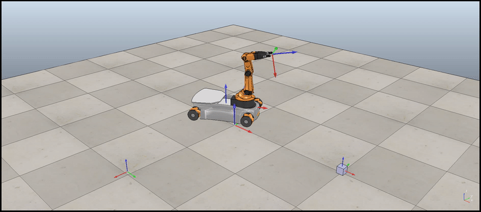
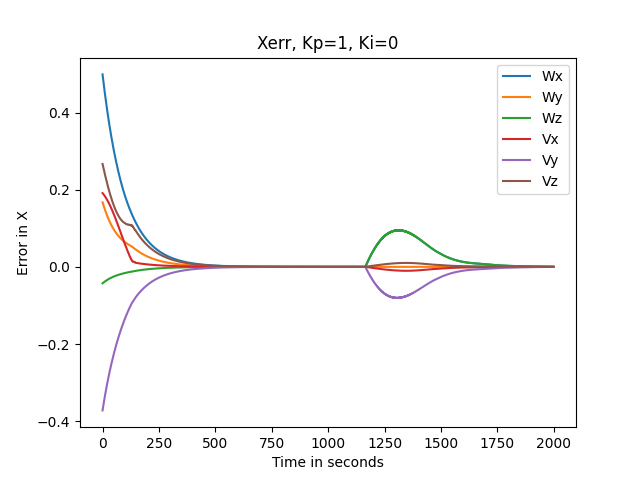
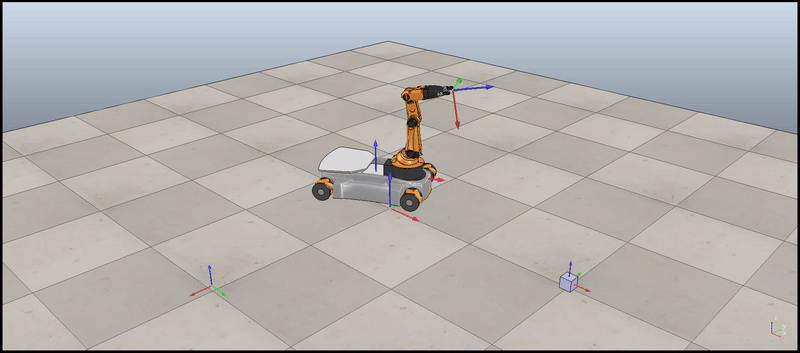
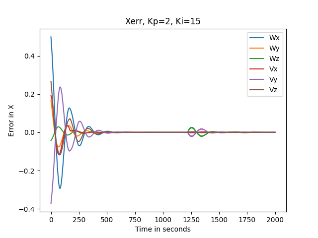
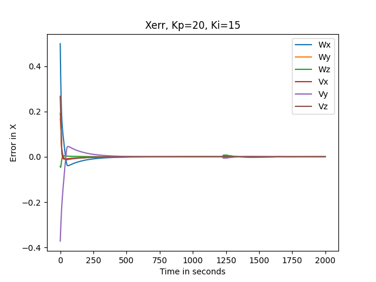
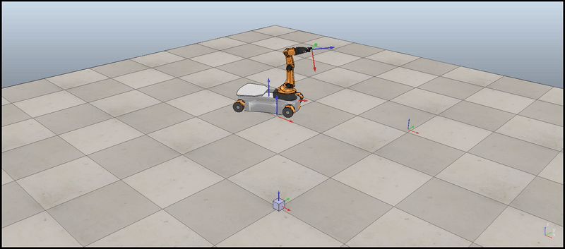
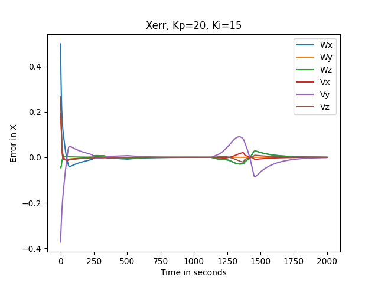

# Motion-Control-of-Mobile-Manipulator-Robot
Simulated trajectory planning and simultaneous odometry with feedback control for the KUKA youBot mobile manipulator, a mobile base with four mecanum wheels and a 5R robot arm, using Python, in CoppeliaSIM software

How to run the code:

1. Each folder contains TrajectoryGenerator, NextState, FeedbackControl functions.
2. Each folder contains the WrapperScript for each of the designated task.
3. In order to run any case, run the WrapperScript of the case.
4. To test the functions, they can directly be executed as they contain the testing code. 
5. Respective csv file will be generated to test it in CoppeliaSim.

For control input calculation of the robot, a feedforward plus PI controller was used. The project thus includes different cases of the control input whose simulation are shown below.

## *Feedforward only controller Case Scenario Simulation in CoppeliaSIM*
We observed that the feedforward-only control uses only desired end effector configurations and 
does not compensate for errors that accumulate during the motion of the end effector from one 
target position to another.

The feedforward only simulation seems to work perfectly but the error graph shown shows exactly the error caused in determining the twist values.

## *Overshoot Case Scenario Simulation in CoppeliaSIM*

Type of Controller: Feedforward plus PI 
Gain values: Kp = 2; Ki = 15

For a feedforward plus PI controller, with a high integral gain, the system displays inconsistent 
behavior as the system overcompensates for the error caused and hence, leads to a negative error 
in the next step. Hence, we can see in the video that the robot overruns the initial location of the 
cube and then compensates with a negative error to bring the end effector back in the right place.

The overshoot case plot shows error spike and thus this denotes the overshoot instance.

## *Best Case Scenario Simulation in CoppeliaSIM*
The simulation below shows the KUKA youBot performing the task of pickup and place with smooth motion and negligible error.

Type of Controller: Feedforward plus PI 
Gain values: Kp = 20; Ki = 15

The error plot for the best case is as shown below.

We observe that for Kp = 20 and Ki= 15, the error plot converged to zero very quickly and also it did not fluctuate as time progressed. This means that the Feedforward plus PI controller in this case was able to minimize and maintain zero error quickly and hence the robot performed the task successfully without any issues.

## *New Case Scenario Simulation in CoppeliaSIM*
In this case, the location of the cube was changed and the robot performanced was simulated.

Type of Controller: Feedforward plus PI 
Gain values: Kp = 20; Ki = 15

The error plot for the new task is as shown below.

With the optimum proportional and integral gain, the new task of lifting the cube from the new 
position and putting it to a new final position is ensured smoothly although we see a little spike 
in the error values, the system compensates and the task is performed successfully as seen in the 
video.